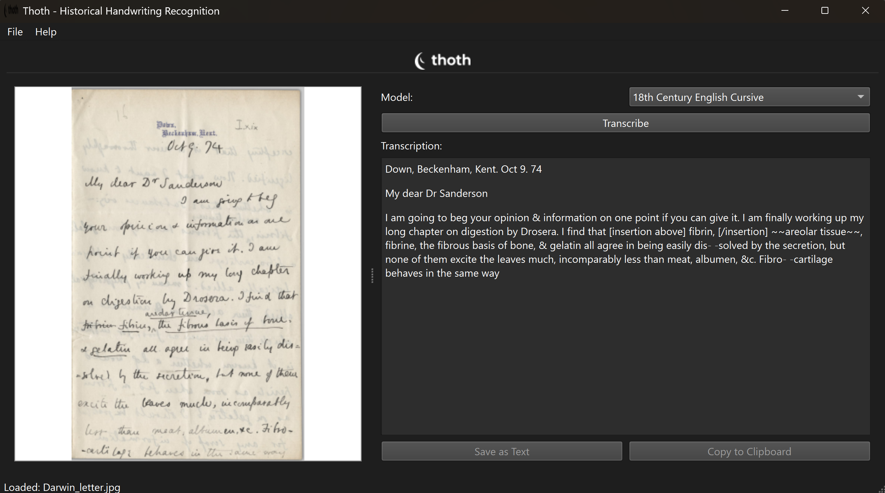

# Thoth


<p align="center">
  <picture>
    <source media="(prefers-color-scheme: dark)" srcset="dev/assets/new-logos/PRIMARY-LOCKUP-cropped-white.svg">
    <source media="(prefers-color-scheme: light)" srcset="dev/assets/new-logos/PRIMARY-LOCKUP-cropped.svg">
    
  </picture>
</p>


### Custom-trained handwriting models delivering up to <strong>99% transcription accuracy</strong> on curated collections.

Thoth is a clean, fast, and modern desktop app for transcribing historical manuscripts. It pairs a robust preprocessing pipeline with fine‑tuned, task‑specific models trained on period scripts to achieve exceptional results.

> Note: Accuracy is reported from internal evaluations on representative, curated datasets. Results can vary based on handwriting style, scan quality, and preprocessing. See "Accuracy and Models" below for details.

<p align="center">
  
  
</p>

## Highlights

- **Custom-trained models**: Purpose‑built LoRA adapters for historical scripts and hands
- **Up to 99% accuracy**: High fidelity on curated collections and clear scans
- **Beautiful, focused UI**: Load, transcribe, and export in seconds
- **Fast inference**: Optimized TrOCR pipeline with GPU acceleration
- **Offline-first**: Run fully locally with your own models and data

## Overview

Thoth helps historians, archivists, librarians, and digital‑humanities teams transcribe challenging handwritten sources. Built on the TrOCR architecture and fine‑tuned via Parameter‑Efficient Fine‑Tuning (LoRA), it provides high accuracy while remaining efficient and portable.

## Features

- **State-of-the-art HTR** powered by TrOCR
- **Custom-trained adapters** for specific periods (e.g., 18th‑c English cursive)
- **Clean PyQt6 desktop app**: cross‑platform, minimal clicks
- **Advanced preprocessing**: binarization, denoising, segmentation
- **Batch processing** and **easy model switching**
- **Export anywhere**: copy to clipboard or save as text

## Installation

### Prerequisites
- Python 3.8+
- CUDA-capable GPU (recommended for training)
- 24GB+ VRAM for model fine-tuning

### Quick Start
```bash
# Clone the repository
git clone https://github.com/rtw878/thoth.git
cd thoth

# Create virtual environment
python -m venv venv
source venv/bin/activate  # On Windows: venv\Scripts\activate

# Install dependencies
pip install -r requirements.txt

# Test the installation
python test_functionality.py
```

## Accuracy and Models

- Our best in‑house adapters reach **up to 99% accuracy** on curated test sets that match their training domain (script, period, scan quality).
- Accuracy depends on handwriting style, document condition, and preprocessing. For new collections, training or fine‑tuning your own adapter usually yields the best results.
- You can drop your own fine‑tuned adapters into `models/` and select them in the app.

## Usage

### GUI Application
```bash
python src/app/main.py
```

The GUI provides:
- Image loading and display
- Model selection from available trained models
- Real-time transcription with progress indication
- Text export and clipboard functionality

### Command Line Tools

#### Download Datasets
```bash
# Download IAM dataset
python src/data/download_data.py IAM

# Download Bentham dataset
python src/data/download_data.py Bentham
```

#### Train Models
```bash
# Train on IAM dataset
python src/model/train_model.py --dataset IAM --output-dir models/my_model

# Train with custom configuration
python src/model/train_model.py --config configs/my_config.yml
```

#### Evaluate Models
```bash
# Evaluate a trained model
python src/evaluate/evaluate_model.py models/my_model --output-file results.json
```

#### Preprocess Images
```bash
# Preprocess a single image
python src/preprocess/image_pipeline.py path/to/image.png

# Preprocess a folder of images
python src/preprocess/image_pipeline.py path/to/folder/
```

## Project Structure

```
thoth/
├── LICENSE
├── README.md
├── requirements.txt
├── .gitignore
├── configs/config.yml          # Main configuration file
├── test_functionality.py       # Test script
├── data/                       # Data directories
│   ├── raw/                    # Original datasets
│   ├── interim/                # Intermediate processed data
│   └── processed/              # Final model-ready data
├── models/                     # Trained model checkpoints
├── notebooks/                  # Jupyter notebooks for exploration
├── reports/figures/            # Generated plots and visualizations
├── src/                        # Source code
│   ├── __init__.py
│   ├── data/
│   │   ├── __init__.py
│   │   ├── download_data.py    # Dataset downloading
│   │   └── dataset_manager.py  # Dataset management
│   ├── preprocess/
│   │   ├── __init__.py
│   │   └── image_pipeline.py   # Image preprocessing
│   ├── model/
│   │   ├── __init__.py
│   │   ├── train_model.py      # Model training
│   │   └── inference.py        # Model inference
│   ├── evaluate/
│   │   ├── __init__.py
│   │   └── evaluate_model.py   # Model evaluation
│   └── app/
│       ├── __init__.py
│       └── main.py             # GUI application
└── docs/                       # Documentation
    ├── conf.py
    └── index.rst
```

## Configuration

The project uses a centralized configuration system in `configs/config.yml`. Key configuration sections:

- **Data paths**: Directory structure for datasets
- **Preprocessing**: Image processing parameters
- **Model parameters**: TrOCR and LoRA configuration
- **Training arguments**: Learning rate, batch size, etc.
- **Application settings**: GUI configuration and available models

## Available Datasets

- **IAM Handwriting Database**: Modern English handwriting (research use only)
- **Bentham Collection**: 18th-19th century English script
- **READ-ICFHR 2016**: Early Modern German documents
- **Custom datasets**: Support for local datasets

## Model Architecture

Thoth uses:
- **Base model**: `microsoft/trocr-large-handwritten`
- **Fine‑tuning**: LoRA (Low‑Rank Adaptation) adapters for efficiency
- **Evaluation**: CER (Character Error Rate) and WER (Word Error Rate)

## Contributing

We welcome contributions! Please see our [Contributing Guide](CONTRIBUTING.md) for details.

1. Fork the repository
2. Create a feature branch
3. Make your changes
4. Add tests
5. Submit a pull request

## Development

### Setting up Development Environment
```bash
# Install development dependencies
pip install -r requirements.txt

# Run tests
python test_functionality.py

# Build documentation
cd docs
make html
```

### Code Style
- Use Black for code formatting
- Follow PEP8 guidelines
- Include type hints and docstrings
- Write unit tests for new functionality

## License

This project is licensed under the MIT License - see the [LICENSE](LICENSE) file for details.

**Note**: Some datasets (like IAM) have non-commercial licenses. Please check dataset licenses before use.

## Citation

If you use Thoth in your research, please cite:

*[TODO: Add citation information]*

## Acknowledgments

- Built on the [Hugging Face Transformers](https://huggingface.co/transformers/) library
- Uses [TrOCR](https://huggingface.co/docs/transformers/model_doc/trocr) architecture
- Inspired by the [Transcribe Bentham](https://blogs.ucl.ac.uk/transcribe-bentham/) project
- Supported by [LoRA](https://github.com/microsoft/LoRA) for parameter-efficient fine-tuning

## Support

For questions and support:
- Open an issue on GitHub
- Check the documentation in `docs/`
- Review the example configurations in `configs/`

---

Built with care for historians and researchers. If you use Thoth, consider starring the repo and sharing feedback—your datasets and use‑cases help us improve models and accuracy.


